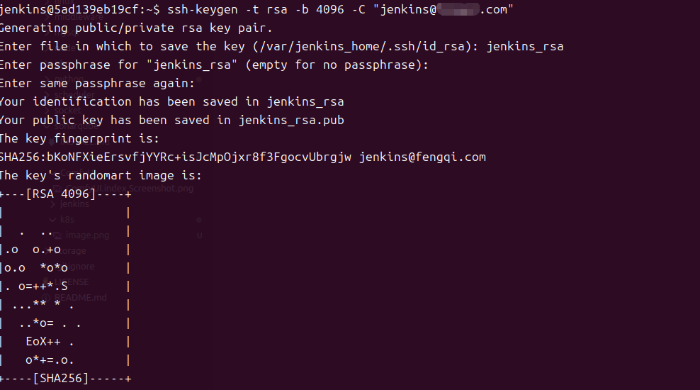
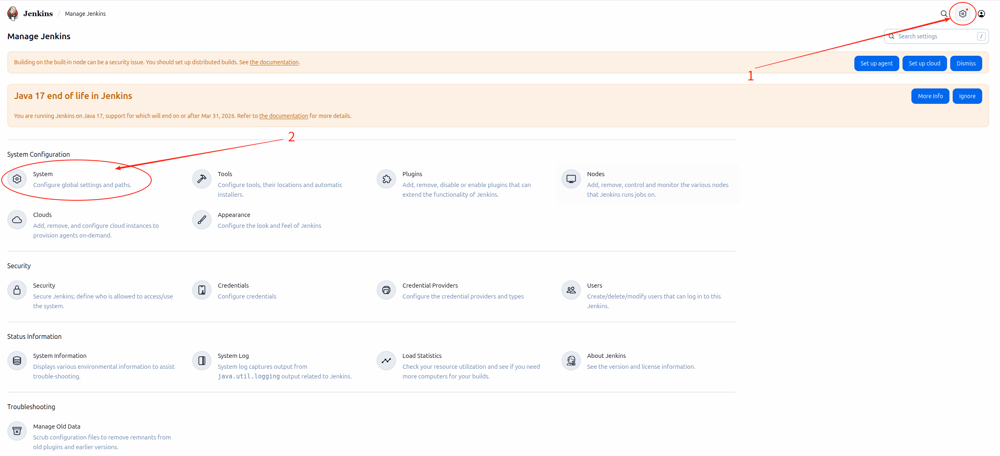
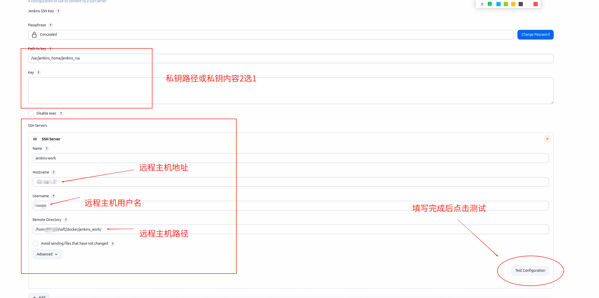

### publish over ssh


### 生成 ssh 密钥
```bash
# 进入 jenkins 容器
sudo docker exec -it jenkins bash
cd /var/jenkins_home/.ssh
# 生成 ssh 密钥
ssh-keygen -t rsa -b 4096 -C "jenkins@domain.com"
# 输入文件名，我这边输入的是 jenkins_rsa
# Enter file in which to save the key (/var/jenkins_home/.ssh/id_rsa): jenkins_rsa
# 输入密码，我这边直接回车
# Enter passphrase (empty for no passphrase): 我这边直接回车

# 查看公钥
cat /var/jenkins_home/.ssh/jenkins_rsa.pub
```



### 为密钥授权
```bash
echo "cat /var/jenkins_home/.ssh/jenkins_rsa.pub 输出的信息" >> ~/.ssh/authorized_keys
chmod 600 ~/.ssh/authorized_keys
```

### 配置 jenkins
1. setting -> system


1. 添加 ssh 密钥
2. 测试设置

