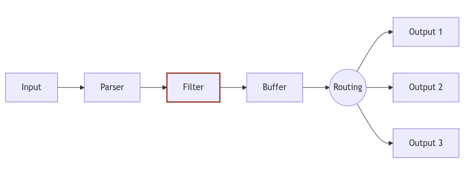

### INSTALL FLUNET-BIT

1. [website](https://fluentbit.io/)
2. [github](https://github.com/fluent/fluent-bit)
3. [docs](https://docs.fluentbit.io/manual/installation/downloads)

### workflow


### sudo ctr images pull cr.fluentbit.io/fluent/fluent-bit:4.2.0-amd64
1. [proxy](../containerd/PROXY.md)
```bash
sudo ctr -n k8s.io images pull cr.fluentbit.io/fluent/fluent-bit:4.2.0-amd64
# sudo ctr images pull cr.fluentbit.io/fluent/fluent-bit:4.2.0-amd64
```

### 导出镜像
```bash
sudo ctr -n k8s.io images export fluent-bit.4.2.0.tar cr.fluentbit.io/fluent/fluent-bit:4.2.0-amd64
ll fluent-bit.4.2.0.tar

# 传输
scp -r fluent-bit.4.2.0.tar root@192.168.1.100:/root/
```

### 导入镜像
```bash
sudo ctr -n k8s.io images import fluent-bit.4.2.0.tar
# 查看镜像列表
sudo ctr -n k8s.io images ls | grep fluent-bit
# or
sudo ctr -n k8s.io images list
```